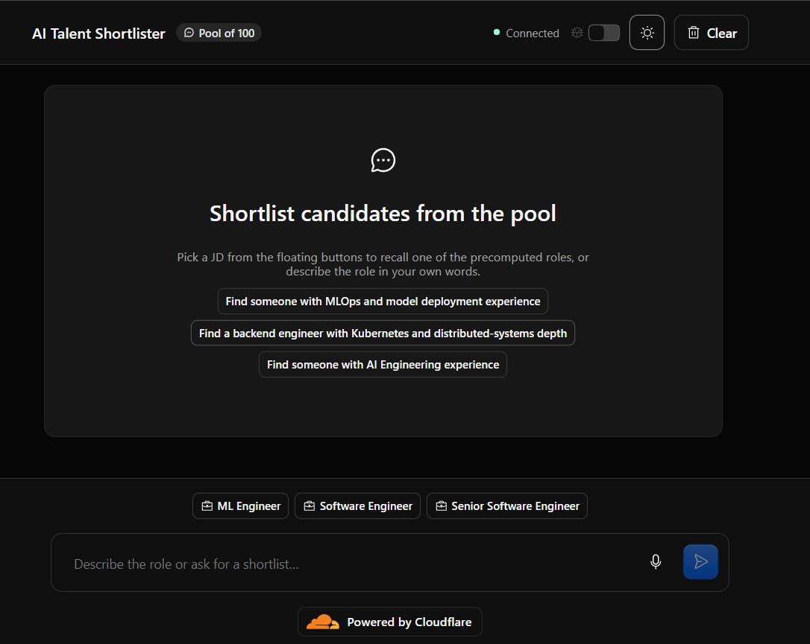
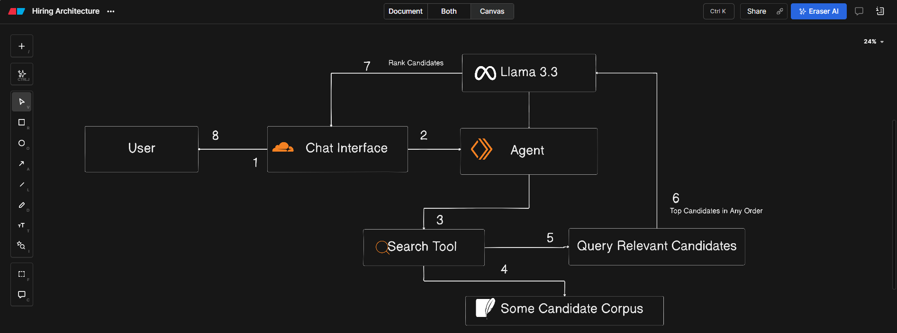

# AI Talent Shortlister

An AI-powered hiring concierge built on Cloudflare. Recruiters shortlist candidates from an **internal talent pool of 100 anonymized profiles** _before_ a job is ever posted externally.

Built for the **Cloudflare AI-Powered Application assignment**.

**Live Demo:** [https://ai-talent-shortlister.24955a6619.workers.dev/](https://ai-talent-shortlister.24955a6619.workers.dev/)

[Overview](#overview) · [Screenshots](#screenshots) · [Architecture](#architecture-diagram) · [How It Works](#how-it-works) · [Getting Started](#getting-started) · [Design Decisions](#design-decisions)

---

## Overview

Hiring teams often read through hundreds of resumes before a role is even posted. AI Talent Shortlister inverts that workflow: the talent pool stays internal, and an AI agent does the retrieval, ranking and evidence-gathering on command.

A recruiter can:

- **Pick a precomputed JD** (ML Engineer, Software Engineer, Senior Software Engineer), or
- **Describe the role in their own words**, by typing or by **voice**.

The agent returns a schema-valid shortlist where every candidate is classified as **Very Strong**, **Strong**, **Partial** or **Not Suitable**, with evidence drawn from that candidate's actual career history.

## Features

- **Chat-first interface** with streaming responses over WebSockets
- **Semantic retrieval** over the full talent pool using live query embeddings
- **LLM re-ranking and classification** into four fit categories
- **Grounded evidence**: bullets are quoted only from the candidate's profile
- **Schema-valid output**: results are validated with Zod, and the UI renders candidate cards, never raw JSON
- **Voice input**: dictate requirements with the mic
- **Persistent conversations** stored in Durable Object SQLite
- **Fully serverless**: runs entirely on Cloudflare (Workers, Workers AI, KV, Durable Objects)

## Screenshots

**Home / chat UI**



**ML Ops JD and shortlist results**


## Architecture Diagram



## How It Works

```
Chat UI ──▶ ChatAgent (Durable Object, SQLite persistence)
     │              │ shortlistCandidates(jdTitle | query, limit)
     │              ▼
     │        bge-base embeds the query (live, Workers AI)
     │              │ cosine similarity
     │              ▼
     │        In-memory pool (100 profiles embedded at seed time, cached from KV)
     │              │ top-N retrieved profiles + JD
     │              ▼
     │        Llama 3.3 re-ranks & classifies each → (rank, category, title, evidence[])
     │              ▼
     └─────  streaming shortlist cards back to the UI
```

1. **User input**: the recruiter clicks a JD button, types free-text requirements, or dictates with the mic.
2. **Retrieval**: the agent calls the `shortlistCandidates` tool. The live query is embedded with `@cf/baai/bge-base-en-v1.5` and matched by cosine similarity against the in-memory pool (default: top 5). Profile embeddings were computed once at seed time and stored in KV alongside each profile.
3. **Re-ranking and classification**: Llama 3.3 (`@cf/meta/llama-3.3-70b-instruct-fp8-fast`) classifies each retrieved profile as Very Strong, Strong, Partial or Not Suitable, with short evidence bullets quoted only from the profile.
4. **Result**: the UI renders ranked candidate cards (rank, name, bucket, title, evidence) from the schema-valid tool result.

## Tech Stack

| Layer             | Technology                                                                        |
| ----------------- | --------------------------------------------------------------------------------- |
| **LLM**           | Llama 3.3 70B (`@cf/meta/llama-3.3-70b-instruct-fp8-fast`) on Workers AI          |
| **Embeddings**    | `@cf/baai/bge-base-en-v1.5` (768-dim, CLS pooling)                                |
| **Agent runtime** | Cloudflare Agents SDK: `ChatAgent` Durable Object + `AIChatAgent`                 |
| **Orchestration** | Vercel AI SDK (`ai@6`): `streamText`, `generateObject`, tool calling              |
| **Storage**       | Cloudflare KV (`HIRING_KV`) + Durable Object SQLite                               |
| **Realtime**      | WebSocket via Cloudflare Agents (`agents/react`)                                  |
| **Frontend**      | React 19, Vite 8, Tailwind CSS v4, Cloudflare Kumo UI, Phosphor Icons, Streamdown |
| **Validation**    | Zod schemas enforcing the shortlist output shape                                  |
| **Tooling**       | TypeScript 6, Wrangler, oxlint, oxfmt                                             |

## Getting Started

### Prerequisites

- Node.js (a current LTS release)
- A Cloudflare account with Workers AI enabled (needed for embeddings and the LLM)

### Run locally

```bash
# 1. Install dependencies
npm install

# 2. Start the dev server
npm run dev

# 3. In another terminal, seed the talent pool (once)
curl -X POST http://localhost:5173/__seed \
  -H "x-seed-token: local-dev-seed-token"
```

Then open `http://localhost:5173` and try a JD button or type a role description.

## Design Decisions

- **Embed once, query live.** Profile embeddings are computed at seed time, so a search only needs to embed the query. Retrieval over 100 profiles is fast enough to do in memory.
- **Two-stage ranking.** Cheap vector similarity narrows the pool to the top N. The larger LLM then judges only those, which keeps cost and latency down.
- **One small `generateObject` call per candidate.** Classifications run in parallel, each with a small schema. This prevents a single large JSON response from being truncated or malformed.
- **Evidence must come from the profile.** The model is instructed to quote only from the candidate's own history, which keeps the shortlist explainable and reduces hallucination.
- **Render from structured results.** The UI displays the validated tool result rather than model prose, so users never see raw JSON or partial, stuttering text.
- **Stateful agent per conversation.** Using a Durable Object gives each chat its own persistent state and a WebSocket connection without a separate backend.

## License

MIT
